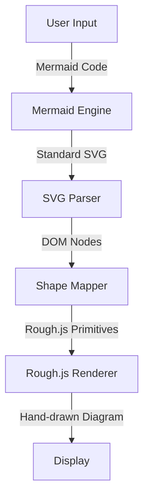

# Mermaid to Rough.js Converter

A web application that converts standard Mermaid.js sequence diagrams into "hand-drawn" sketch-style diagrams using Rough.js.

## 🏗 Architecture Approach

We utilize a **Post-Processing** strategy to achieve the hand-drawn look while maintaining the robust layout capabilities of Mermaid.js.

### Core Workflow

1.  **Layout Generation**: We use the native `mermaid.render()` function to generate a strict SVG diagram. This handles all the complex logic of positioning actors, lifelines, and messages.
2.  **Parsing**: The resulting SVG string is parsed into a DOM tree.
3.  **Translation (Style Transfer)**:
    *   We traverse the SVG DOM.
    *   **Rectangles** (Activations, Notes) are mapped to `rough.rectangle`.
    *   **Lines/Paths** (Messages, Lifelines) are mapped to `rough.path` or `rough.line`.
    *   **Text** is preserved but styled with handwritten fonts (e.g., 'Indie Flower' or 'Patrick Hand').
4.  **Rendering**: The new Rough.js primitives are drawn onto a target Canvas or SVG container.

### Technology Stack

*   **Frontend Framework**: React (Vite)
*   **Diagram Engine**: `mermaid`
*   **Sketching Library**: `roughjs`
*   **Styling**: Vanilla CSS

## Features (Planned)

*   [x] Architecture Design
*   [x] Live Editor (Split pane: Code / Sketch)
*   [x] Support for Sequence Diagrams
*   [ ] Export to PNG/SVG
