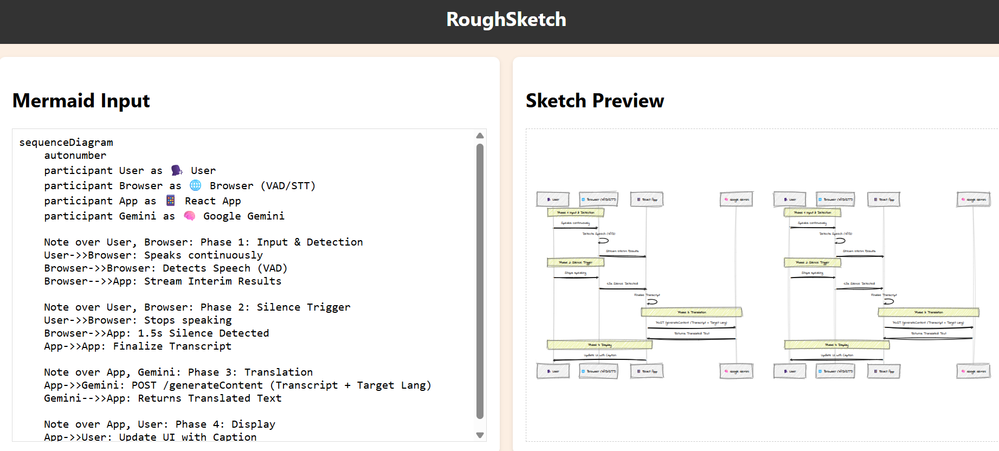

# RoughSketch ✏️

Transform your Mermaid.js sequence diagrams into beautiful hand-drawn sketches. Perfect for presentations, documentation, and making technical diagrams feel more approachable.


## 📸 Preview



## ✨ Features

- 🎨 **Live Editor** - Split-pane interface with real-time preview
- ✏️ **Hand-Drawn Style** - Converts formal diagrams into sketch-style visuals
- ⚡ **Fast & Responsive** - Built with React and Vite
- 🔄 **Sequence Diagram Support** - Full support for Mermaid sequence diagrams
- 🎯 **Zero Config** - Just paste your Mermaid code and go

## 🚀 Quick Start

### Local Development

```bash
# Clone the repository
git clone https://github.com/abhinav1singhal/roughsketch.git
cd roughsketch

# Install dependencies
npm install

# Start development server
npm run dev
```

Visit `http://localhost:5173` to see the app in action!

### Production Build

```bash
npm run build
npm run preview
```

## 🎯 How It Works

RoughSketch uses a **post-processing** approach:

1. **Mermaid.js** generates the diagram layout and SVG structure
2. **SVG Parser** extracts geometric shapes and paths
3. **Rough.js** redraws each element with a hand-drawn aesthetic
4. **Custom Fonts** apply handwritten typography for authenticity

## 🛠 Technology Stack

- **React** - UI framework
- **Vite** - Build tool and dev server
- **Mermaid.js** - Diagram parsing and layout
- **Rough.js** - Hand-drawn rendering
- **Docker** - Containerization for deployment

## 📦 Deployment

Deploy to Google Cloud Run with a single command:

```bash
gcloud run deploy roughsketch \
    --source . \
    --platform managed \
    --region us-central1 \
    --allow-unauthenticated
```

See [DEPLOY.md](DEPLOY.md) for detailed deployment instructions.

## 🤝 Contributing

Contributions are welcome! Feel free to open issues or submit pull requests.

## 📄 License

This project is licensed under the MIT License - see the [LICENSE](LICENSE) file for details.

## 🙏 Acknowledgments

- [Mermaid.js](https://mermaid.js.org/) - For the amazing diagram engine
- [Rough.js](https://roughjs.com/) - For the hand-drawn graphics library
- [Indie Flower](https://fonts.google.com/specimen/Indie+Flower) - For the handwritten font

---

**Made with ❤️ by [Abhinav Singhal](https://github.com/abhinav1singhal)**
